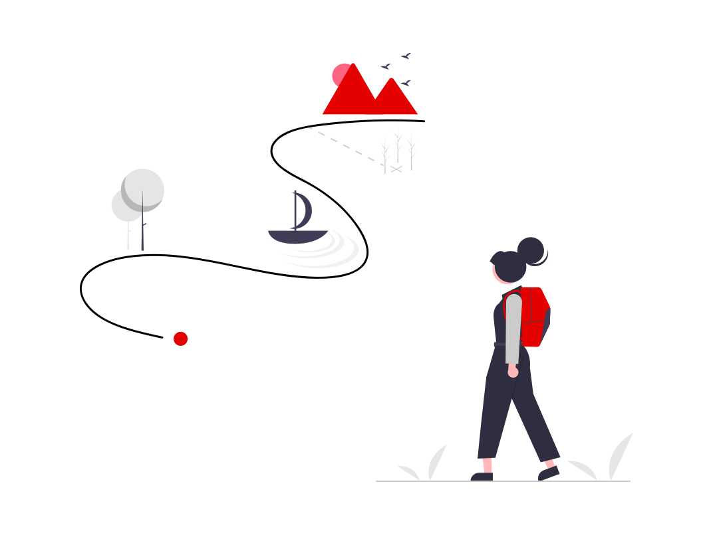

<h1> Olá! Que bom te ver por aqui</h1>
 

 </img>
 </img>
  

## Sobre mim
- ⏭️ Dev Android Jr.
- 👩‍🎓 Último semestre no curso de Desenvolvimento de Software na 🏫 FATEC.
- 📚 Amo ler.
- :octocat: Mãe de duas gatas.

## Estudando as linguagens
 `.kt` `.java` `.py` `.dart` `.html`  `.css`

## Social Medias 🌎

### Visitantes 👁️ 👁️  
  
   
<!--
**paulademelo/paulademelo** is a ✨ _special_ ✨ repository because its `README.md` (this file) appears on your GitHub profile.

Here are some ideas to get you started:

- 🔭 I’m currently working on ...
- 🌱 I’m currently learning ...
- 👯 I’m looking to collaborate on ...
- 🤔 I’m looking for help with ...
- 💬 Ask me about ...
- 📫 How to reach me: ...
- 😄 Pronouns: ...
- ⚡ Fun fact: ...
-->
