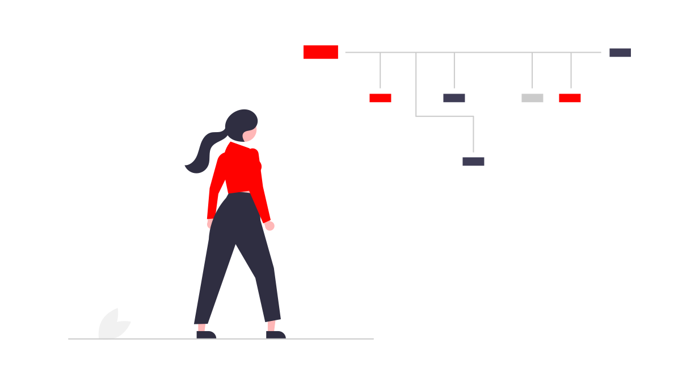

<h1>🕵️‍♀️ Olá! Que bom te ver por aqui 🙋‍♀️</h1>

## Quem sou eu
- ⏭️ Caloura na programação.
- 👩‍🎓 1º Semestre no curso de Desenvolvimento de Software na 🏫 FATEC.
- 🏗️ Futura Full Stack.
- 📚 Adoro ler.
- 👩‍❤️‍👨 Casada.
- :octocat: Mãe de duas gatas.

## Estudando as linguagens:construction_worker_woman:🦖 
`.c++` , `.py`, `.kt`, `.html`, `.css`

## Conheça minhas redes sociais 🌎:
- 💼 Meu perfil do <a href="https://www.linkedin.com/in/paulademelo/">LinkedIn</a>
- 💃 Meu perfil do <a href="https://www.instagram.com/paulameloti/">Instagram</a>

### Visitantes 👁️ 👁️  
  
   
<!--
**paulademelo/paulademelo** is a ✨ _special_ ✨ repository because its `README.md` (this file) appears on your GitHub profile.

Here are some ideas to get you started:

- 🔭 I’m currently working on ...
- 🌱 I’m currently learning ...
- 👯 I’m looking to collaborate on ...
- 🤔 I’m looking for help with ...
- 💬 Ask me about ...
- 📫 How to reach me: ...
- 😄 Pronouns: ...
- ⚡ Fun fact: ...
-->
